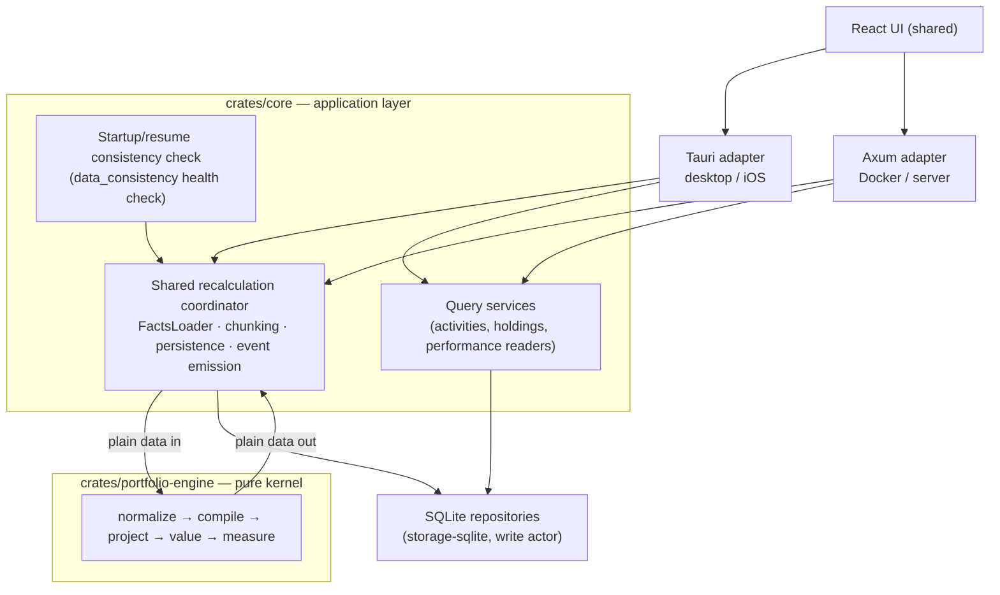

# Portfolio Engine — PRD, Specification & Implementation Plan

|                       |                                                                                                                                                                                                                                                                                       |
| --------------------- | ------------------------------------------------------------------------------------------------------------------------------------------------------------------------------------------------------------------------------------------------------------------------------------- |
| **Status**            | Draft for maintainer review                                                                                                                                                                                                                                                           |
| **Date**              | 2026-08-14                                                                                                                                                                                                                                                                            |
| **Scope**             | New `crates/portfolio-engine` pure calculation kernel, its oracle/fixture suite, and the staged migration of the calculation path onto it                                                                                                                                             |
| **Related**           | Architecture review WF-ARCH-2026-08 (Revision 3); `docs/architecture/adapters.md`; `docs/features/performance-semantics-design.md`                                                                                                                                                    |
| **Decision baseline** | Maintainer decision (R3): modular monolith; in-memory events retained; lightweight startup/resume consistency check; **no** durable messaging; Tauri + Axum call one shared recalculation coordinator; kernel knows nothing about Tauri, iOS, Axum, Docker, async runtimes, or SQLite |
| **Oracle baseline**   | Pin to `origin/main` **including PR #1443** (issue #1425 fix) **and** the in-flight dividend/interest gross-amount attribution change, landed first (step 0.1). All legacy goldens are captured at one recorded commit.                                                               |

---

## 1. Context and problem statement

Wealthfolio's macro-architecture is sound (React UI, two hosts — Tauri for
desktop/iOS, Axum for Docker/server — over shared Rust crates and SQLite). The
bugs cluster in the **calculation path**: since 2026-01, 58% of commits touching
`crates/core/src/portfolio` are fixes, and the recurring incident classes (#1388
empty-currency import, #913 snapshot wipe, #1229 transfer unmasking a cash
deficit, #1178 stale valuation status, the UTC-default-date bug, planner
coalescing) all trace to the same structural causes:

1. **No single economics authority.** `ActivityCompiler` (DRIP/staking
   expansion), `ActivityEconomicsResolver` (cash/charges/flow ladder), the
   holdings-calculator handlers, `flow_classifier`, and the valuation service's
   per-day flow assembly are five partial authorities that each re-interpret
   activities.
2. **Impure calculation core.** The holdings calculator holds
   `Arc<dyn FxServiceTrait>` and `Arc<RwLock<String>>` runtime config and
   queries services mid-fold; `Utc::now()` appears ~190 times in `core`; results
   depend on clock, cache, and lock state — not just on facts.
3. **Silent degradation.** `parse::<Decimal>().unwrap_or(ZERO)` — the
   `parse_decimal_lossy` helper is **defined four times** (valuation service,
   holdings-calculator economics, holdings service, performance service) — plus
   a silent `"USD"` currency fallback (`resolve_currency`, ingest layer),
   FX-failure fallbacks that add unconverted amounts, and stringly-typed domain
   data (`LotClosure` dates and quantities as `String`).
4. **Unenforced boundaries.** `crates/core` links diesel, tokio, reqwest — "keep
   the math pure" is convention, not compilation.
5. **Duplicated host coordination.** The portfolio job sequence (quote-reconcile
   → market sync → FX init → snapshots → reconcile → valuations → events) exists
   **four times** (Tauri queue worker, Tauri listeners, server queue worker,
   server API shared), on top of per-host planner copies with real behavioral
   drift (Tauri's domain-event path never selects `IncrementalFromLast`; its
   legacy listener path does; the two can race, unguarded).
6. **Latent nondeterminism.** Same-day activities are ordered by timestamp with
   **no tiebreaker** — equal timestamps fall back to SQLite scan order; FX
   resolution is nearest-neighbor **in both directions** (a later-arriving rate
   can change a historical valuation).
7. **Tests can't isolate the math.** ~1,500-line mock blocks copy-pasted per
   test file; zero golden files; zero property tests on the calculation path
   (proptest is a dev-dep but used only by the health module); no test runs all
   four real stages (activities → snapshots → valuation → performance).

This document specifies the remedy agreed in the architecture review: extract
the calculation math into **one new crate**, `crates/portfolio-engine` — a pure,
deterministic, dependency-firewalled kernel — **built and battle-tested against
a comprehensive fixture oracle before anything uses it**, then wire both hosts
onto a single shared coordinator that calls it.

---

## 2. Product requirements

### 2.1 Goals

- **G1 — Single economics authority.** Every downstream consumer (accounting,
  valuation, performance, health) reads canonical `EconomicEvent`s produced by
  one compile stage. No consumer re-interprets raw activities.
- **G2 — Deterministic, pure kernel.** Same facts in → byte-identical results
  out, on any host, any day, any machine. No clock, no I/O, no locks, no async
  in the kernel.
- **G3 — Compile-time boundary.** The kernel crate's dependency list is the
  enforcement: `chrono`, `rust_decimal`, `serde` only. Adding tokio/diesel is a
  build failure, not a review comment.
- **G4 — Battle-tested before integration.** A comprehensive fixture oracle
  (nominal + edge + regression scenarios), golden snapshots, property tests, and
  a legacy-parity harness — all green **before** any production call site
  changes.
- **G5 — Honest degradation.** Missing/invalid inputs produce typed diagnostics
  and statuses, never silent zeros or silent fallbacks.
- **G6 — One coordinator, two hosts.** Tauri and Axum call the same
  application-level recalculation coordinator; the four duplicated job sequences
  collapse to one; host-specific code shrinks to UI events, auth, and
  scheduling.
- **G7 — Provable incremental correctness.** Full ≡ IncrementalFromLast ≡
  SinceDate ≡ chunked, guaranteed by property tests, not by hope.

### 2.2 Non-goals

- No event sourcing, CQRS, Kafka, durable messaging, persistent job queues, or
  dirty-ledger table (R3 decision — the startup/resume consistency check covers
  host lifecycles; the dirty-range table remains a documented escalation only).
- No microservices, actor frameworks, DI containers, or salsa-style
  incremental-computation engines.
- No new persistence format; SQLite schema changes limited to what the
  consistency check needs (nothing expected).
- No rewrite of market-data fetching, broker sync, device sync, or the frontend
  (except deleting the duplicated economic derivations in P4).
- No semantic redesign of returns, cost basis, or flow classification — **v1
  policy codifies current behavior**; intentional changes go through the
  divergence ledger, one at a time, maintainer-signed.
- No behavior changes to the app before the parity harness proves equivalence.

### 2.3 Acceptance criteria

The project is done when all of the following hold:

1. `crates/portfolio-engine` exists; its **runtime** dependency tree contains
   only `chrono`, `rust_decimal`, `serde` (+ derive). A CI check fails the build
   if anything else appears.
2. Every scenario in the catalog (§5.3) has fixture facts and a kernel golden;
   every **parity-eligible** scenario (neither **[K]** kernel-only nor **[S]**
   shell-level) also has a legacy golden captured at the pinned baseline commit,
   and kernel output matches it — except for deltas itemized in the divergence
   ledger, every entry maintainer-approved.
3. The property suite (§5.4) is green in CI: replay equivalence, chunk
   equivalence, determinism-under-shuffle, conservation, split invariance,
   transfer scope, reconciliation, aggregation, degradation honesty.
4. Kernel tests contain **zero mocks** — every test is facts-in/values-out.
5. Both hosts call the shared coordinator; the four duplicated job sequences,
   both planner copies, and the per-host backfill checks are deleted; both hosts
   boot with the consistency-check-driven repair instead of
   full-rebuild-on-launch / rebuild-if-empty.
6. The consistency check (watermark: `MAX(activities.updated_at)` + row count vs
   the last projection's recorded watermark) runs at cold start on both hosts,
   on iOS resume, and after device-sync apply; a kill-mid-recalc test proves
   scoped resume.
7. Benchmark: full 10-year rebuild of the reference dataset is **no slower**
   than the current path (expected faster — parse-once, no mid-fold locks or
   service calls).
8. All existing core tests pass (adjusted where they asserted ledger-documented
   behavior).

---

## 3. Target architecture

### 3.1 Topology

Two backend hosts, three deployment forms, one calculation kernel. Still a
modular monolith — not a distributed system.



The kernel knows nothing about Tauri, iOS, Axum, Docker, async runtimes, or
SQLite. Hosts retain host-specific UI events, authentication, and scheduling.
The in-memory event system remains the intra-process signaling mechanism.

### 3.2 Responsibility split

| Concern                                                                                                   | Kernel (`portfolio-engine`) | Shell (`core` coordinator + hosts + storage) |
| --------------------------------------------------------------------------------------------------------- | --------------------------- | -------------------------------------------- |
| Economic interpretation of activities (transfer pairing in `normalize`, flow classification in `compile`) | owns                        | —                                            |
| Position/cash/lot projection, net contribution                                                            | owns (project)              | —                                            |
| Quote/FX **resolution** (carry, minor-unit normalization, inverse/triangulation, split-factor detection)  | owns, as explicit policy    | —                                            |
| Quote/FX **fetching** (providers, retry, sync)                                                            | —                           | owns (`market-data`)                         |
| Daily valuation, flow finalization & performance math                                                     | owns (value, measure)       | —                                            |
| What to recalculate, when, for whom                                                                       | —                           | owns (coordinator + check)                   |
| Persistence (sparse keyframes, dense valuation rows, batching, transactions)                              | —                           | owns (repositories, write actor)             |
| Caching, single-flight, parallelism                                                                       | enabled by purity           | owns                                         |
| Event emission, auth, scheduling, UI                                                                      | —                           | owns (hosts)                                 |
| Clock ("today"), user timezone                                                                            | parameters                  | supplies                                     |
| Pagination / search / queries                                                                             | —                           | owns                                         |

Rule of thumb: anything whose answer could differ between two machines (network,
disk, clock, cache) is shell; anything two machines must agree on given the same
facts is kernel.

Persistence note: today, snapshots are **sparse keyframes** (first day or
activity days) while valuations are **dense daily rows**. The kernel emits the
dense daily series; the coordinator keeps the existing keyframe cadence and row
formats — persistence strategy is untouched by this project.

### 3.3 Lifecycle model (R3 decision)

iOS can suspend abruptly; desktop can close mid-work; containers restart. The
remedy is **not** durable messaging — it is:

1. **In-memory events** for intra-process signaling (unchanged;
   `core/src/events/sink.rs` best-effort contract stands).
2. **Consistency check** at cold start (both hosts), iOS resume, and after
   device-sync apply: per-account watermark — `MAX(activities.updated_at)` plus
   activity **row count** (count catches hard deletes, timestamp catches edits)
   — compared against the last projection's recorded watermark. Mismatch →
   scoped per-account recalc, surfaced as a `ConsistencyIssueType` with a
   `FixAction` in the existing `data_consistency` health check. _Known
   residual:_ a sync-applied delete-then-reinsert that restores the row count
   while carrying a **backdated** `updated_at` is invisible to this watermark; a
   per-account content checksum is the documented escalation if that case ever
   occurs in practice.
3. **Chunked persists** (§4.3 project contract): every committed chunk is a
   consistent prefix, so an interrupted recalc resumes from the last chunk
   watermark instead of restarting. (This also retires today's acknowledged
   non-atomic snapshot range overwrite — delete and save currently span separate
   write-actor transactions.)
4. **Worker retry with backoff** for in-process job failures (the one gap
   lifecycle hooks can't see); repeated failures surface via the health check.
   The coordinator also serializes recalc jobs, closing today's unguarded race
   between the Tauri listener path and the domain-event worker.

---

## 4. Crate specification — `crates/portfolio-engine`

### 4.1 Placement and dependency contract

```
crates/portfolio-engine/
├── Cargo.toml            # runtime deps: chrono, rust_decimal, serde ONLY
├── src/
│   ├── lib.rs            # public API: the five stage functions + facts_needed
│   ├── model/            # Money, Quantity, BusinessDate, ids, Policy,
│   │                     # EconomicEvent, Facts, surfaces, states, reports
│   ├── normalize.rs      # stage 1 (parsing, ordering, transfer pairing)
│   ├── compile.rs        # stage 2 (single economics authority)
│   ├── project.rs        # stage 3 (+ lots/)
│   ├── value.rs          # stage 4 (resolution policy + flow finalization)
│   ├── measure.rs        # stage 5
│   └── diagnostics.rs
└── tests/
    ├── fixtures/         # scenario YAMLs + goldens (§5.1)
    ├── golden.rs         # scenario runner → insta snapshots
    ├── properties.rs     # proptest invariants (§5.4)
    └── DIVERGENCES.md    # the divergence ledger (§5.5)
```

**Runtime dependencies (closed list):** `chrono` (no `clock` feature use),
`rust_decimal`, `serde`/`serde_derive`. **Dev-dependencies** (tests only):
`serde_yaml`/`serde_json` (fixture loading), `insta` (goldens), `proptest`
(properties), `criterion` (bench). Dev-deps never leak into the runtime tree.

**Enforcement (part of Phase 1, not optional):** a CI script asserting
`cargo tree -p wealthfolio-portfolio-engine -e no-dev` contains exactly the
allowed set. This is the compile-time firewall that `crates/core` (which links
diesel, tokio, reqwest) never had.

**Dependency direction:** hosts → `core` (coordinator, services, health) →
`portfolio-engine`. `core` gains `portfolio-engine` first as a
**dev-dependency** (parity harness, Phase 1) and later as a regular dependency
(Phase 3). `portfolio-engine` depends on no workspace crate.

### 4.2 Domain model

All types are plain data: `Clone + Debug + PartialEq + Serialize + Deserialize`.
No `Arc`, no trait objects, no interior mutability.

**Scalar types — parse, don't validate.** Constructed once in `normalize`;
interior stages never see raw strings.

```rust
pub struct Currency(/* opaque validated code: non-empty, trimmed,
                       case-preserved. A bucket key and FX-pair component —
                       it does NOT know minor-unit relations; that table is
                       Policy DATA (see Policy.currency below). */);
pub struct Money     { pub amount: Decimal, pub currency: Currency }
pub struct Quantity  (Decimal);          // signed; negative = short lot
pub struct BusinessDate(NaiveDate);      // user-local calendar date, derived
                                         // from the UTC instant via Policy.timezone
pub struct AccountId(String);            // opaque
pub struct AssetId(String);              // opaque (asset-model-v2 UUIDs)
pub struct ActivityId(String);
```

Rationale: kills the
`LotClosure { close_date: String, original_quantity: String }` class, all four
`parse_decimal_lossy` sites, and the silent `"USD"` currency fallback. A `Money`
cannot lack a currency (#1388's root shape); a `BusinessDate` cannot carry a
UTC-midnight bug — the timezone conversion happens exactly once, under policy.

**Facts (inputs).** The complete world the kernel is allowed to know:

```rust
pub struct RawFacts {          // mirrors DB rows; strings allowed HERE only.
                               // Per-invocation SCOPE, not the database —
                               // see §4.7 memory envelope.
    pub accounts:   Vec<RawAccount>,      // currency, type, tracking mode,
                                          // cost-basis method
    pub activities: Vec<RawActivity>,     // full field set incl. subtype,
                                          // override, status, metadata,
                                          // source_group_id, fx_rate
    pub assets:     Vec<RawAsset>,        // quote_ccy, kind/instrument type,
                                          // contract multiplier, quote mode
    pub quotes:     Vec<RawQuote>,        // observations, not resolutions
    pub fx_rates:   Vec<RawFxRate>,       // observations
    pub observed_snapshots: Vec<RawObservedSnapshot>, // holdings-mode FACTS
    pub policy:     Policy,
}

pub struct Policy {            // every tunable explicit and serialized;
                               // v1 values CODIFY CURRENT BEHAVIOR
    pub base_currency: Currency,
    pub currency: CurrencyPolicy,         // minor-unit rule table as DATA:
                                          //   Vec<MinorUnitRule { minor, major,
                                          //   multiplier, case_sensitive }>.
                                          //   Kernel ships today's table
                                          //   (GBp/GBX→GBP ×0.01, ZAc→ZAR,
                                          //   KWF→KWD ×0.001, ILA→ILS, USX→USD;
                                          //   case-sensitive GBp) as the
                                          //   default; the MECHANISM (where
                                          //   normalization applies: activity
                                          //   currencies in normalize —
                                          //   idempotent, never trusting
                                          //   ingest; quote closes and FX
                                          //   pairs in value) is kernel law.
                                          //   New minor unit = data change,
                                          //   not an engine release.
    pub timezone: TzPolicy,               // UTC-instant → user-local BusinessDate
    pub as_of: BusinessDate,              // "today" is DATA, not a clock read
    pub ordering: OrderingPolicy,         // total order: (user-local date,
                                          //   source timestamp, ActivityId)
    pub fill: FillPolicy,                 // v1: unbounded carry-forward of the
                                          //   last quote ≤ D (current behavior),
                                          //   PLUS carried-age diagnostics;
                                          //   incl. split-factor DETECTION
                                          //   (series-looks-adjusted heuristic,
                                          //   candidate clustering + source
                                          //   ranking) and application
    pub fx: FxPolicy,                     // v1 codifies current ladder:
                                          //   per-day direct → inverse →
                                          //   nearest-observation both
                                          //   directions (tie → past) →
                                          //   multi-hop path → none
    pub cost_basis: CostBasisMethod,      // v1: FIFO only (Lifo/Wac rejected,
                                          //   as today)
    pub rounding: RoundingPolicy,         // DECIMAL_PRECISION, defined points
}
```

Holdings-mode observed snapshots are **facts** (inputs), not projections — the
#913 lesson encoded in the type system: the persistence layer can only ever
rebuild what the kernel derived, never what a user/broker observed.

**`EconomicEvent` (the single authority).** Everything downstream reads these;
nobody reads raw activities past the compile stage. The type absorbs today's
five partial authorities: compiler expansion (DRIP/staking/ dividend-in-kind
two-leg splits), `resolve_cash` (sign-by-type, supplied amount authoritative,
gross/charge separation), the transfer performance-flow ladder,
`flow_classifier` scope rules, and the calculator handlers' postings.

```rust
pub struct EconomicEvent {
    pub id: EventId,                      // synthetic legs keep traceable ids
                                          // ({id}:dividend, {id}:buy — as today)
    pub source: ActivityId,               // full traceability fact → number
    pub date: BusinessDate,
    pub account: AccountId,
    pub cash_postings: Vec<CashPosting>,      // (Currency, signed amount) —
                                              // booking currency per current
                                              // fx_rate convention
    pub position_postings: Vec<PositionPosting>, // (AssetId, signed Quantity)
    pub lot_instruction: Option<LotInstruction>, // open/close/adjust/split/transfer
    pub external_flow: Option<ExternalFlow>,  // scope-aware + provenance;
                                              // MAY BE DEFERRED — see below
    pub charges: Charges,                     // fees, taxes, classified
    pub net_contribution_effect: Option<Money>, // deposits/withdrawals/BONUS/
                                              // transfers (basis-valued), as today
    pub diagnostics: Vec<Diagnostic>,
}
```

`ExternalFlow` carries **scope** (account vs portfolio — a matched internal
transfer is external at account scope, zero at portfolio scope) and
**provenance** (today's `ExternalFlowSource` ladder: cash amount, quote-derived
market value, cost-basis fallback, removed-lot-basis fallback, legacy-amount
fallback, unknown boundary — preserved so return-eligibility gating keeps
working). Transfer pairing (by `source_group_id`, then same-day match
heuristics) is resolved deterministically in `normalize`.

**Deferred flows.** Two ladder steps cannot be priced at compile time because
they need later-stage outputs — the removed-lot-basis fallback for unquoted
security TRANSFER_OUTs (needs stage-3 lot disposals) and inferred holdings-mode
transition flows (need stage-4 keyframe valuations). `compile` emits these with
**deferred provenance**; `value` finalizes them (mirroring where legacy resolves
them today). `measure` consumes only finalized flows, carried on the
`ValuationSeries`.

**Outputs.**

```rust
pub struct CompiledLedger   { pub events: Vec<EconomicEvent>, pub diagnostics: Vec<Diagnostic> }
pub struct ProjectionState  { /* positions (signed, single-signed per asset),
                                 lots (typed; FIFO book), cash by currency,
                                 cost basis, net_contribution(+base) —
                                 state at one date */ }
pub struct ProjectionBundle { pub days: Vec<(BusinessDate, ProjectionState)>,
                              pub closures: Vec<LotClosure>,      // typed
                              pub disposals: Vec<LotDisposal>,    // typed
                              pub diagnostics: Vec<Diagnostic> }
pub struct ValuationSeries  { pub days: Vec<DailyValuation> }
                              // each day: values, statuses, AND finalized
                              // external flows (amount, scope, provenance)
pub struct PerformanceReport{ /* TWR series, MWR, value return, attribution
                                 (income/fees/taxes/realized/unrealized/fx),
                                 risk (volatility, max drawdown), annualized
                                 returns (≥30-day gate), flows used,
                                 not-applicable reasons */ }
```

**Status model.** For parity, `DailyValuation.value_status` keeps the legacy
three-value vocabulary (`Complete` / `PartialUnpriced` / `Unavailable`) and
`basis_status` keeps `Complete` / `PartialUnknown` / `Unknown` /
`NotApplicable`, with the same absorption laws. Richer detail — carried-quote
age, which FX pair was missing, which fallback fired — travels in `diagnostics`,
not in new status values. A consumer that ignores diagnostics sees exactly
today's statuses; a consumer that cares (health, UI badges) gets the truth.

### 4.3 Stage contracts

```rust
/// 1. Strings → types, once. Bad data becomes diagnostics/errors HERE.
///    Applies OrderingPolicy (total order — today equal timestamps fall back
///    to SQLite scan order; the kernel adds the ActivityId tiebreaker).
///    Resolves transfer pairs deterministically. Filters non-Posted
///    activities (Draft/Pending/Void are invisible to calculations, as today).
pub fn normalize(raw: RawFacts) -> (CanonicalFacts, Vec<Diagnostic>);

/// 2. Single economics authority. Total over the 14-type × 10-subtype
///    vocabulary (Appendix B): every (effective type, canonical subtype,
///    status) maps to events or to a diagnostic. May consult quote/FX
///    surfaces (they are data): the security-transfer flow ladder prices
///    external transfers at transfer-day quotes, as today. Ladder steps that
///    need later-stage outputs emit DEFERRED provenance (finalized in value).
pub fn compile(facts: &CanonicalFacts) -> CompiledLedger;

/// 3. Fold events into daily state. Incremental = same fold, prior state
///    as INPUT. Resumable: project(A..B) then project(B..C from state(B))
///    ≡ project(A..C).  (Invariants I1/I2 — property-tested.)
///    Includes cross-account same-day ordering (transfer topological order)
///    and the paired-transfer lot cache — both inside the fold, since the
///    fold spans all accounts in scope.
pub fn project(
    ledger: &CompiledLedger,
    start: Option<ProjectionState>,
    range: DateRange,
) -> ProjectionBundle;

/// 4. Price the states. Surfaces are OBSERVATIONS; resolution (carry-forward,
///    minor-unit normalization, direct/inverse/nearest/multi-hop FX,
///    split-price-factor detection + application for provider-adjusted
///    series) happens here under Policy, and is reported per-day via
///    value_status + diagnostics. FINALIZES deferred flows: removed-lot-basis
///    substitution (from bundle disposals) and inferred holdings-mode
///    transition flows (from keyframe valuations) — the ValuationSeries
///    carries the final per-day flows measure consumes.
pub fn value(
    proj: &ProjectionBundle,
    observed: &[ObservedSnapshot],       // holdings-mode facts enter here
    quotes: &QuoteSurface,
    fx: &FxSurface,
    policy: &Policy,
) -> ValuationSeries;

/// 5. Returns math over the valuation series (values + finalized flows):
///    TWR (start-of-day inflows, end-of-day outflows, daily chain-linking,
///    fatal/benign/pre-chain day taxonomy incl. #1443 leading-negative-prefix
///    skip), XIRR (bisection, annualized), value return, holdings-mode
///    book-basis returns, attribution with residual tolerance, risk
///    (volatility, max drawdown), annualization (≥30-day gate).
pub fn measure(
    vals: &ValuationSeries,
    policy: &Policy,
) -> PerformanceReport;

/// Helper for the coordinator: what to load for a given scope/range —
/// asset ids, currency pairs, quote/FX lookback window, transfer-pair
/// closure (paired accounts outside the requested set). Pure.
pub fn facts_needed(scope: &Scope, range: DateRange, policy: &Policy) -> FactsRequest;
```

Pre/post-conditions:

- **No stage performs I/O, reads a clock, spawns, or locks.** All are total
  functions of their arguments.
- **No stage panics on user data.** Panics are reserved for internal invariant
  violations (kernel bugs); property tests hunt those.
- **Inputs are data-complete.** If `value` needs an FX rate that isn't
  resolvable from the surface, that is a typed degradation + diagnostic — never
  a fetch, never a silent `rate = 1`, never an unconverted add.
- **Chunking is the caller's right.** The coordinator may call `project`/
  `value` over sub-ranges feeding `final_state()` forward; equivalence with
  one-shot is guaranteed (I2) and battle-tested.
- **Per-activity atomicity is preserved.** A failing activity contributes a
  diagnostic and zero state mutation (today's scratch-clone semantics), never a
  partial application.

### 4.4 Error and diagnostics model

Two channels, deliberately distinct:

- **`Err(EngineError)`** — the _request_ is unusable (range inverted, policy
  invalid, prior state doesn't match range start, duplicate activity ids). The
  caller made a mistake.
- **`Diagnostic`s** — the _data_ is imperfect (unparseable decimal, missing
  currency, unknown subtype, missing quote, unresolvable FX, unpaired transfer
  boundary, negative cash). Attached to the event/day they affect, aggregated on
  the bundle/series, each carrying a code, severity, source ids, and a message.
  Health checks render them; the UI can badge them; they are **never** silently
  dropped and never turned into zeros.

### 4.5 Invariants (the contract, testable)

| ID      | Invariant                                                                                                                                                                                                                                                                                                       |
| ------- | --------------------------------------------------------------------------------------------------------------------------------------------------------------------------------------------------------------------------------------------------------------------------------------------------------------- |
| **I1**  | **Replay equivalence.** `project(genesis..T)` ≡ `project(D..T, from state(D−1))` for any D. Full ≡ IncrementalFromLast ≡ SinceDate. (Subsumes today's append-only restriction and the split-in-window restart-from-inception rule: the kernel needs neither.)                                                   |
| **I2**  | **Chunk equivalence.** Any partition of a range, folding `final_state` forward, yields identical daily states to one-shot.                                                                                                                                                                                      |
| **I3**  | **Determinism.** Identical `RawFacts` (incl. `as_of`, policy) → byte-identical outputs, independent of machine, wall clock, or input `Vec` order.                                                                                                                                                               |
| **I4**  | **Cash conservation.** Per account & currency bucket: closing cash = opening cash + Σ cash postings. No cash appears or vanishes outside events.                                                                                                                                                                |
| **I5**  | **Position & lot conservation.** Position quantity = Σ position postings; open-lot effective quantities (quantity × split_ratio) sum to position quantity (transactions mode); positions stay single-signed per asset; closed lots never mutate.                                                                |
| **I6**  | **Split invariance.** A split changes lot split-ratios only (for lots acquired before the split's local date), never position value at the split instant, never cost basis totals, never external flows, never cash.                                                                                            |
| **I7**  | **Transfer scope.** A matched internal transfer produces equal-and-opposite effects at account scope and **zero** external flow at portfolio scope (when both accounts are in the evaluated scope); paired security transfers preserve lot acquisition dates and basis; net-contribution effects are symmetric. |
| **I8**  | **Valuation reconciliation.** Day-over-day: `Δvalue = external_flows + event_effects + market_and_fx_movement + unreconciled`, where `unreconciled` is an explicit diagnostic term (mirrors today's attribution-residual tolerance; target zero, never silently absorbed).                                      |
| **I9**  | **Aggregation.** Portfolio valuation = Σ account valuations (same policy, same day); portfolio flows = account flows net of internal transfers (via I7); status/provenance combine by the legacy absorption laws (degradation never upgrades).                                                                  |
| **I10** | **Degradation honesty.** Every carried/missing/estimated/fallback input is visible in status or diagnostics. No silent zeros, no silent `rate = 1`, no silent USD, no silent fills.                                                                                                                             |

### 4.6 Determinism rules

- `as_of` ("today") and the user timezone are `Policy` fields. The kernel never
  reads a clock; `chrono` is used for date arithmetic only.
- The activity's calendar date is its UTC instant converted via
  `Policy.timezone`, computed once in `normalize` (today this conversion is
  scattered and one FX path uses the raw UTC date — REG-UTC pins it).
- Same-day ordering is a **total order**: user-local date → source timestamp →
  `ActivityId`. Today's order (timestamp, then SQLite scan order) is undefined
  on ties; the tiebreaker is a divergence-ledger entry (behavior-preserving
  wherever timestamps are unique). Cross-account same-day transfer ordering
  (topological, source-before-destination) is preserved inside `project`.
- Compiled legs preserve source order; income leg precedes buy leg (as today).
- Iteration over maps in any output-affecting path uses ordered structures
  (`BTreeMap`) — no `HashMap` ordering leaks.
- Rounding is a policy (current `DECIMAL_PRECISION` behavior) applied at defined
  points (posting, valuation, report), not ad-hoc.
- FX nearest-neighbor resolution may look **forward** in time (current behavior,
  kept in v1): a valuation is deterministic given the FX surface, and the
  surface is part of the facts. The consequence — late-arriving rates change
  historical valuations — is a _recalc-triggering_ concern for the coordinator,
  not a kernel concern.

### 4.7 Memory envelope and scoping

`RawFacts` is **per-invocation scope, not the database**. Three facts keep the
envelope bounded:

1. **The legacy pipeline already holds this much in memory.** Today the
   valuation service pre-loads sparse quotes for _all_ in-scope assets over the
   _whole_ batch range into `SharedValuationFacts`; the FX `CurrencyConverter`
   is built from **all** historical rates and held in a `RwLock`; the holdings
   calculator materializes each account's full snapshot series before
   persisting. The kernel changes none of these magnitudes — it makes the
   working set explicit and adds the chunking escape hatch the legacy path
   lacks.
2. **Real magnitudes are modest.** A heavy portfolio — 100k activities, 200
   assets, 10 years — is roughly 25–50 MB of activities and 50–100 MB of sparse
   quote observations (≈500k rows), plus a few MB of FX. And that is the
   _load-everything-at-once_ worst case, which the coordinator never needs to
   do.
3. **`facts_needed(scope, range)` is the scoping mechanism.** A per-account
   recalc loads one account's activities and its assets' quotes, plus the
   transfer-pair closure (paired counterpart activities/lots). A chunked recalc
   loads observations covering
   `[chunk_start − last-observation-per- asset-≤-start, chunk_end]` (and, for FX
   nearest-neighbor, the closest observation on each side of the chunk boundary)
   — bounded without loading history.

Parallelism granularity: `value` and `measure` are per-account and parallelize
freely (today's concurrency-~4 batch pattern carries over). `project` folds a
**transfer-closure group** — accounts connected by same-run transfers must fold
together (topological order, shared lot cache); unconnected accounts/groups
parallelize. Each worker holds only its group's facts.

If profiling ever demands more (it shouldn't at personal-portfolio scale), the
pure escape hatch is exposing the fold's inner step
(`step_day(state, day_events) → state`) for O(1)-memory streaming — a shelf
item, documented here, not built. SCALE-01 is the benchmark that keeps this
section honest.

---

## 5. Oracle & fixture strategy — battle-testing before first use

> The engine ships to production only after it has survived: (a) the full
> scenario catalog with maintainer-reviewed goldens, (b) differential parity
> against the legacy pipeline on every parity-eligible scenario, (c) property
> tests over generated activity streams, and (d) a benchmark. **The oracle is
> built first (Phase 0), against the CURRENT code at a pinned baseline commit,
> before the crate exists** — otherwise "extensive tests" merely verify our own
> assumptions.

### 5.1 Fixture architecture

One scenario = one YAML file of **facts** + human-readable intent + expected
economics notes; outputs are **insta snapshots** (goldens) generated, then
human-reviewed and committed.

```
crates/portfolio-engine/tests/fixtures/
├── scenarios/
│   ├── nom/     NOM-TRADE-01.yaml, ...
│   ├── edge/    EDGE-CCY-01.yaml, ...
│   ├── perf/    PERF-TWR-01.yaml, ...
│   ├── reg/     REG-1388.yaml, ...            # real-incident regressions
│   ├── life/    LIFE-INC-02.yaml, ...          # incremental/lifecycle
│   └── scale/   SCALE-01.yaml                  # generated, large
├── goldens/
│   ├── legacy/  <id>.snap   # captured from CURRENT pipeline (Phase 0)
│   └── kernel/  <id>.snap   # produced by the kernel (Phase 1+)
└── DIVERGENCES.md            # every legacy≠kernel delta, maintainer-signed
```

Scenario file shape (illustrative):

```yaml
id: EDGE-CCY-01
title: GBp-quoted asset in a GBP account — minor-unit normalization
intent: >
  LSE asset quoted in pence (GBp). Buy from a GBP account. Valuation must
  normalize close ×0.01; lot base rates and disposal cost_basis_base must use
  the normalized major unit; the GBp/GBP "pair" must never be treated as a real
  FX conversion.
facts:
  policy: { base_currency: GBP, timezone: Europe/London, as_of: 2025-03-05 }
  accounts: [...]
  assets: [...]
  activities: [...] # timestamps unique — see capture-determinism note
  quotes: [...]
  fx_rates: [...]
expected_notes: >
  Cash −(qty×price×0.01 + fee); position priced at close×0.01; lowercase 'gbp'
  must NOT be treated as pence (case-sensitive rule).
```

Three harnesses consume the same scenario files:

1. **Legacy capture harness** (Phase 0, lives in `crates/core` tests): builds
   the CURRENT full pipeline over **in-memory trait implementations**
   (consolidating today's copy-pasted mock blocks into one shared test-support
   module) — real `SnapshotService` → real `ValuationService` → real
   `PerformanceService`, the wiring seam already proven at service-constructor
   level in existing tests — and serializes canonical outputs into
   `goldens/legacy/`. No production test today runs all four real stages; this
   harness is the first, and is a safety asset in its own right. Run twice in CI
   to assert the capture itself is deterministic.
2. **Kernel golden runner** (Phase 1+, in `portfolio-engine`): same facts → five
   stages → `goldens/kernel/` via insta.
3. **Parity harness** (Phase 1+, in `crates/core` with `portfolio-engine` as
   dev-dependency): diffs kernel vs legacy goldens per parity-eligible scenario;
   a mismatch fails CI unless the delta is itemized in `DIVERGENCES.md`. This
   runs on every PR from the day it lands, so **any live fix to the legacy path
   that breaks parity surfaces the same day**, not at integration.

**Capture-determinism disciplines** (the sweep surfaced each of these):

- Fixture activities carry **unique timestamps** — the legacy path has no
  same-timestamp tiebreaker (SQLite scan order), so equal-timestamp fixtures
  would make the oracle itself nondeterministic. The kernel's total order is
  exercised by kernel-only scenarios (EDGE-ORD-01), not by parity.
- The legacy pipeline reads the clock (`user_today`, `Utc::now`) with no
  injection point, so captures drift across days (trailing carried rows). The
  capture harness therefore **clamps its calculation window and serialized
  output to the scenario's `as_of`**; where that is insufficient a test-only
  clock seam in `core` test-support is permitted (Phase 0 allows test-support
  additions, never production behavior changes). Clock-relative behaviors that
  can't be fixtured this way (e.g., future-dated valuation rows) are **[S]**
  shell-level scenarios, tested at the coordinator layer.
- One additional real-DB scenario (SCALE-02) runs the same facts through the
  **storage-sqlite** repositories (tempdir + migrations + write actor — the
  existing integration-test recipe) to catch Diesel serialization drift that
  in-memory trait implementations can't see.
- The deterministic fixture quote provider already used by E2E
  (`crates/market-data/src/provider/fixture/`) is reused wherever a scenario
  wants generated OHLCV series rather than hand-written quotes.

### 5.2 Canonical output format

Goldens serialize a stable, human-diffable projection of results (YAML, sorted
keys, fixed decimal scale): per-day positions
`(asset, qty, split_ratio, cost_basis)`, cash by currency bucket, lot
inventory + closures + disposals `(realized_pnl, base attribution)`, valuation
`(value, value_status, basis_status)`, external flows
`(scope, amount, provenance)`, net contribution (account + base), TWR/MWR/
value-return to fixed precision, attribution components, risk metrics, and the
diagnostics list `(code, severity, source)`.

Both harnesses emit this format, and **the parity diff compares every section
except `diagnostics`** — the diagnostics channel is a kernel addition with no
legacy counterpart (legacy warnings are log lines), so it is reviewed in kernel
goldens but never parity-gated. Everything else — values, statuses, flows,
provenance — must match or be ledgered.

### 5.3 Scenario catalog

IDs are stable and referenced from code comments, the divergence ledger, and
commit messages. **The catalog is the contract's test surface: a change in
kernel behavior must point at the scenario that sanctions it.** Markers:

- **[L]** — expected divergence-ledger entry: kernel intentionally differs from
  the captured legacy golden (§5.5).
- **[K]** — kernel-only scenario: no legacy golden exists (the behavior has no
  deterministic legacy capture); reviewed via kernel goldens only.
- **[S]** — shell-level scenario: tested at the coordinator/persistence layer
  (Phase 3), outside kernel parity.

#### Family NOM — nominal semantics, per type × subtype

| ID           | Scenario                                                                                                                                                                                                          |
| ------------ | ----------------------------------------------------------------------------------------------------------------------------------------------------------------------------------------------------------------- |
| NOM-CASH-01  | Deposit then withdrawal, single currency; cash and net_contribution track exactly (same resolved amount on both)                                                                                                  |
| NOM-CASH-02  | Interest credit + standalone fee; income vs charge classification; charges never touch net_contribution                                                                                                           |
| NOM-CASH-03  | CREDIT subtype matrix — BONUS vs REBATE vs REFUND vs REIMBURSEMENT vs none: only BONUS moves net_contribution and counts as external flow                                                                         |
| NOM-CASH-04  | Standalone FEE with both `amount` and `fee` set to different values; TAX with only `fee` set — pins `resolve_cash` vs `charge_amt_for` precedence differences                                                     |
| NOM-TRADE-01 | Buy → hold → partial sell → sell-all; FIFO lots open/close; realized P&L; disposal base attribution (proceeds at disposal-date FX, basis at acquisition-date FX)                                                  |
| NOM-TRADE-02 | BUY with supplied `amount` deviating from qty×price+fee+tax (broker rounding) — supplied amount authoritative for cash; gross (amount−charges) drives lot basis; explicit **zero** amount trusted, not re-derived |
| NOM-TRADE-03 | Fractional asset multiplier 0.1 (commit 14ed09093) — derived amounts and gross trade value use 0.1 exactly                                                                                                        |
| NOM-TRADE-04 | Zero-price buy and bond amount-based trade — derived-amount fallbacks                                                                                                                                             |
| NOM-DIV-01   | Cash dividend; income = gross_amount (amount + charges, per the landed attribution change); no position change; no net_contribution                                                                               |
| NOM-DRIP-01  | DIVIDEND+DRIP two-leg expansion — income leg + buy leg, net cash ≈ 0, withholding tax stays on income leg, buy leg fee=tax=0, synthetic ids `{id}:dividend`/`{id}:buy`                                            |
| NOM-DRIP-02  | DRIP with stale `unit_price = 0` and positive amount — buy-leg price derives amount/qty                                                                                                                           |
| NOM-STAKE-01 | INTEREST+STAKING_REWARD dust: amount 0, price 0, tiny quantity — zero-FMV lot, explicit zero trusted                                                                                                              |
| NOM-DIK-01   | DIVIDEND_IN_KIND two-leg expansion                                                                                                                                                                                |
| NOM-SPLIT-01 | 2:1 split — I6 holds; only lots acquired before the split's user-local date get the ratio; same-day post-split buy untouched                                                                                      |
| NOM-SPLIT-02 | 1:10 reverse split + broker-emitted fractional-share SELL same day — effective-unit FIFO consumption, no double-adjustment                                                                                        |
| NOM-SPLIT-03 | Split ratio carried in `quantity` with `amount` NULL (bridge convention fallback)                                                                                                                                 |
| NOM-TXF-01   | Cash transfer out A → in B (paired via source_group_id); I7 at both scopes; net_contribution ± amount                                                                                                             |
| NOM-TXF-02   | Paired security transfer — lots move through the transfer cache with original acquisition dates/basis; source account processes before destination (topological order); net_contribution −basis/+basis symmetric  |
| NOM-TXF-03   | External security TRANSFER_IN with book basis (unit_price; fee capitalized, tax not), and the legacy variant (quantity + amount, no unit_price) — cost-basis vs legacy-amount fallback, provenance recorded       |
| NOM-TXF-04   | TRANSFER_IN of long lots into an account short the same asset — cover proration, disposal recording, net_contribution relief                                                                                      |
| NOM-TXF-05   | External security TRANSFER_OUT with **no quote** at transfer date — flow deferred at compile, finalized in `value` from removed-lot basis (RemovedLotBasisFallback provenance)                                    |
| NOM-SHORT-01 | Equity sell-short (POSITION_OPEN) → partial buy-to-cover (POSITION_CLOSE); cover cash prorated to closed quantity; excess-close rejected                                                                          |
| NOM-OPT-01   | Option STO → implicit netting on over-sell → partial BTC → OPTION_EXPIRY on residual: negative lots, multiplier, zero-proceeds expiry, no cash                                                                    |
| NOM-OBS-01   | Holdings-mode account: observed keyframes only; inferred flow = V(new,day) − V(old,day) at transition-day prices; split factors anchored on the previous keyframe's own date                                      |
| NOM-MIX-01   | Transactions account + holdings account in one portfolio; I9 aggregation; internal transfers removed at portfolio scope                                                                                           |
| NOM-FX-01    | USD asset in CAD account: buy, hold across an FX step, sell — acquisition-date FX anchors book cost; valuation-date FX moves market value only                                                                    |
| NOM-FX-02    | Cash booking convention: activity with `fx_rate` set books in account currency at amount×rate; without it, in the activity-currency bucket                                                                        |

#### Family EDGE — degradation, boundaries, hostile data

| ID                  | Scenario                                                                                                                                                                                                                                   |
| ------------------- | ------------------------------------------------------------------------------------------------------------------------------------------------------------------------------------------------------------------------------------------ |
| EDGE-DEC-01 **[L]** | Unparseable decimal in a monetary field → typed diagnostic + exclusion (kernel) vs silent ZERO (legacy `parse_decimal_string_tolerant` fallback)                                                                                           |
| EDGE-DEC-02 **[L]** | Corrupt lot-disposal record — legacy `parse_decimal_lossy` silently contributes 0 to the removed-lot-basis transfer flow; kernel: diagnostic + degraded provenance                                                                         |
| EDGE-CUR-01 **[L]** | Activity with missing/empty currency (#1388 shape) — legacy books into the `""` cash bucket (the key-misalignment mechanism); kernel: account-currency fallback + diagnostic                                                               |
| EDGE-CUR-02 **[K]** | All currency candidates empty at normalize — kernel emits a diagnostic instead of any silent default (the ingest layer's silent `"USD"` fallback sits outside the captured pipeline; no legacy golden)                                     |
| EDGE-CCY-01         | GBp-quoted asset, GBP account — ×0.01 normalization through valuation, lot base rates, and disposal cost_basis_base                                                                                                                        |
| EDGE-CCY-02         | Case-sensitivity: lowercase `gbp` is **not** pence; `GBX`/`ZAc`/`ILA`/`USX`/`KWF` rule table                                                                                                                                               |
| EDGE-CCY-03         | Minor-unit "pair" (GBp/GBP) resolves to the multiplier product, never a market FX conversion; same-major pair registration refused                                                                                                         |
| EDGE-QT-01          | Weekend/holiday — every calendar day is valued; weekend rows carry Friday's close and FX                                                                                                                                                   |
| EDGE-QT-02          | Months-stale quote still prices (unbounded carry, current behavior) with `Complete` status — kernel adds a carried-age diagnostic, status unchanged                                                                                        |
| EDGE-QT-03          | Asset with no quotes at all → typed zero contribution, `PartialUnpriced`/`Unavailable` per the priced/cash rules — never a silent zero                                                                                                     |
| EDGE-QT-04          | Provider-adjusted quote series + pre-split holdings — split price factors detected (series-looks-adjusted heuristic) and applied to dates before the split                                                                                 |
| EDGE-QT-05          | Unadjusted quote series across a split — detection heuristic must NOT apply factors; plus competing same-asset split candidates within a day — clustering + source ranking (user-modified/MANUAL/CSV > other > GENERATED) picks the winner |
| EDGE-FX-01          | FX via inverse rate only (per-day map direct → inverse)                                                                                                                                                                                    |
| EDGE-FX-02          | FX via multi-hop path (no direct pair; triangulation through an intermediate currency)                                                                                                                                                     |
| EDGE-FX-03          | FX bidirectional nearest-observation: a holiday valuation picks the next day's rate when nearer; tie prefers past                                                                                                                          |
| EDGE-FX-04 **[L]**  | Base-FX pair fully unresolvable on day D — legacy **fails the entire account recalculation**; kernel emits the day with typed degradation and continues                                                                                    |
| EDGE-FX-05          | Deposit on a date with no FX to base — net_contribution advances, base leg skips (account/base series drift) — diagnostic pins current behavior                                                                                            |
| EDGE-FX-06 **[L]**  | End-of-day cash totals with an unconvertible currency — legacy silently **adds the unconverted amount** into the total; kernel: degraded status + diagnostic                                                                               |
| EDGE-CASH-01        | Withdrawal exceeding cash while investments cover total value — cash bucket goes negative (unbounded accumulator); diagnostic; the #1229 mechanism (health fires only on total_value < 0)                                                  |
| EDGE-CC-01          | INTEREST on a CREDIT_CARD account — routes to the charge handler yet books a positive cash delta (captures current behavior verbatim; pins open question 4)                                                                                |
| EDGE-POS-01         | SELL of a non-existent position — cash-only effect + warning diagnostic, no lot artifacts                                                                                                                                                  |
| EDGE-POS-02         | Plain BUY while short / plain SELL that would push an equity short — rejected without intent subtype; the failed activity leaves zero state mutation (atomicity)                                                                           |
| EDGE-ORD-01 **[K]** | Same-day activities with equal timestamps, deliberately shuffled input order — kernel output identical (total order with ActivityId tiebreak); legacy is scan-order-dependent, so no legacy golden exists                                  |
| EDGE-ORD-02         | Same-day A→B→C transfer chain — topological account ordering, no phantom negative balances                                                                                                                                                 |
| EDGE-TZ-01          | Activities near midnight in a non-UTC profile timezone — calendar-date bucketing via policy timezone (split eligibility, flow dating, perf windows)                                                                                        |
| EDGE-DUP-01         | Duplicate activity ids in facts → `EngineError` (malformed request), not double-count                                                                                                                                                      |
| EDGE-STATUS-01      | Identical BUY in Posted vs Draft vs Pending vs Void — only Posted affects anything                                                                                                                                                         |
| EDGE-OVERRIDE-01    | UNKNOWN type + `activity_type_override = DIVIDEND` + DRIP subtype — override wins everywhere, expansion still fires                                                                                                                        |

#### Family PERF — return-measurement semantics

| ID           | Scenario                                                                                                                                                                          |
| ------------ | --------------------------------------------------------------------------------------------------------------------------------------------------------------------------------- |
| PERF-TWR-01  | Flow timing convention: r = (V*t + out − V*{t−1} − in) / (V\_{t−1} + in); chart final point equals headline by construction                                                       |
| PERF-TWR-02  | Dormant dust days (denominator < 1 base unit) pause compounding without nulling the headline                                                                                      |
| PERF-TWR-03  | Unavailable valuation day or unknown-boundary flow day → headline nulled with typed not-applicable reason                                                                         |
| PERF-IRR-01  | XIRR bisection: converging case, no-sign-change warning case, <2-flows NA case                                                                                                    |
| PERF-FLOW-01 | Unpaired TRANSFER_IN without `flow.is_external` metadata — Unknown boundary nulls TWR/IRR; a resolved pair overrides stale metadata                                               |
| PERF-FLOW-02 | Same-day deposit + withdrawal — gross flows when explicit provenance exists vs netted under net-contribution fallback (quality warning)                                           |
| PERF-FLOW-03 | Resolved transfer pair with one account **outside the evaluated scope** (e.g., archived/ineligible) — the straddling pair classifies External, not Internal                       |
| PERF-ATTR-01 | Attribution reconciles to value delta within tolerance (max(1, 0.2%) rule); FX effect = base change − local change at end FX                                                      |
| PERF-ATTR-02 | Activity in a currency with no FX rate on its date — attribution component skipped with warning, residual diagnostic fires                                                        |
| PERF-HOLD-01 | Holdings-mode dated range: chained daily flow-adjusted return subtracting only explicit-gross flows; all-time = book-basis return                                                 |
| PERF-HOLD-02 | Holdings transition with one unpriced side — `UnpricedHoldingsTransition` gates returns, marker sticky through fallback stamping and aggregation                                  |
| PERF-MIX-01  | Mixed transactions+holdings scope: component-sum value return; percent nulled unless coverage complete for every in-scope account                                                 |
| PERF-CASH-01 | Pure CASH account in a foreign currency across an FX move — cash-only fx_effect populates attribution within tolerance                                                            |
| PERF-RISK-01 | Volatility (√365.25-scaled stdev of ln(1+r), paused days excluded), max drawdown (peak/trough/recovery), annualization computed ≥30 days and geometric — matches legacy constants |

#### Family REG — real-incident regressions (each pins a shipped bug)

| ID               | Incident                                                                                                                                                                                                                                                                                                       |
| ---------------- | -------------------------------------------------------------------------------------------------------------------------------------------------------------------------------------------------------------------------------------------------------------------------------------------------------------- |
| REG-1388         | CSV import empty currency — apply-path fallback must be account currency (key alignment); detection diagnostic for existing rows (kernel side of EDGE-CUR-01)                                                                                                                                                  |
| REG-0913 **[S]** | Full rebuild must NOT destroy observed (manual/CSV/broker) snapshots — legacy `overwrite_all_snapshots_for_account` deletes ALL sources; the coordinator + facts/projections separation makes the wipe structurally impossible. Coordinator-layer test (Phase 3)                                               |
| REG-1229         | Account funded purely by DRIP, then TRANSFER_OUT of all shares — net_contribution ends at −(DRIP basis) **by design**; portfolio aggregation nets to zero; the transfer merely unmasks any pre-existing cash deficit                                                                                           |
| REG-1178 **[S]** | Backfilled quotes after a PartialUnpriced period — legacy IncrementalFromLast never reprices persisted rows (stale statuses); the consistency check + coordinator revalue the affected span. Coordinator-layer test (Phase 3); the kernel side is trivially covered by determinism (same facts → repriced day) |
| REG-UTC          | Activities near midnight, non-UTC profile — one timezone policy end-to-end (legacy FX latest-rate lookup uses the raw UTC date while valuation uses user-tz today)                                                                                                                                             |
| REG-1425         | Pre-funding: negative/zero junk rows before first real deposit — leading-negative-prefix skipped for TWR, value return anchored at first point ≥ 1 base unit (**PR #1443 semantics, the pinned baseline**)                                                                                                     |
| REG-COAL         | Two rapid edits at D1 < D2 → one coalesced batch with since_date = min; result ≡ full replay                                                                                                                                                                                                                   |

#### Family LIFE — incremental, lifecycle & coordination equivalence

| ID                   | Scenario                                                                                                                                                                                                                |
| -------------------- | ----------------------------------------------------------------------------------------------------------------------------------------------------------------------------------------------------------------------- |
| LIFE-INC-01          | Append a new activity after the high-water mark → SinceDate path seeds from prior state; result ≡ full (I1)                                                                                                             |
| LIFE-INC-02          | Backdated **edit** of an existing activity — legacy auto-upgrades SinceDate→Full (lots table holds only the current book); kernel: same fold from earlier state, ≡ full; watermark (updated_at) triggers the check      |
| LIFE-INC-03          | Hard delete an activity → row-count watermark triggers; recalc ≡ full                                                                                                                                                   |
| LIFE-INC-04          | Delete-then-reinsert: the reinsert stamps a fresh `updated_at`, so MAX advances and the watermark catches it even with the count restored. (The backdated-`updated_at` sync variant is the documented residual — §3.3.) |
| LIFE-INC-05          | Split arriving inside an incremental window with earlier history — legacy restarts from inception; kernel replay ≡ full without the special case                                                                        |
| LIFE-CHK-01          | Chunked quarterly project/value ≡ one-shot (I2); goldens byte-identical                                                                                                                                                 |
| LIFE-CHK-02          | Simulated kill after chunk k → resume from k reproduces one-shot goldens (retires the non-atomic range-overwrite crash window; kernel side is I2, persistence side is a Phase 3 e2e)                                    |
| LIFE-STATE-01        | `project` with prior state whose date doesn't match range start → `EngineError`, not corruption                                                                                                                         |
| LIFE-CONC-01 **[S]** | Concurrent trigger paths (today: unguarded listener job racing the queue worker) — coordinator serializes. Shell test                                                                                                   |
| LIFE-EMPTY-01        | Delete the last activity of an account → stale projections cleared, observed snapshots untouched                                                                                                                        |
| LIFE-FUT-01 **[S]**  | Persisted valuation row dated in the future → legacy silently escalates to full replace; check surfaces it as an issue. Clock-relative — coordinator-layer test                                                         |

#### Family SCALE — performance envelope

| ID       | Scenario                                                                                                                                                                                       |
| -------- | ---------------------------------------------------------------------------------------------------------------------------------------------------------------------------------------------- |
| SCALE-01 | Generated: 10 years × 200 assets × ~50k activities, multi-currency, splits + transfers mixed in. Criterion bench; budget = current-path time. Doubles as a soak input for property invariants. |
| SCALE-02 | FULL-CHAIN facts run through the real storage-sqlite repositories (tempdir + migrations + write actor) — catches Diesel/TEXT serialization drift vs in-memory capture                          |

### 5.4 Property-based tests

Generators produce arbitrary-but-valid activity streams (typed constructors make
invalid states unrepresentable, so generators compose from the same vocabulary
the compile stage accepts): random accounts/currencies/assets, interleaved
activity types and subtypes, random quote/FX surfaces with gaps, random split
ratios, paired and unpaired transfers.

| Property | Invariant | Sketch                                                                             |
| -------- | --------- | ---------------------------------------------------------------------------------- |
| P-REPLAY | I1        | ∀ stream, ∀ split-date D: full ≡ incremental-from-D                                |
| P-CHUNK  | I2        | ∀ stream, ∀ random partition: chunked ≡ one-shot                                   |
| P-DET    | I3        | shuffle input Vec order → identical outputs                                        |
| P-CASH   | I4        | replay conservation per account × currency bucket                                  |
| P-LOTS   | I5        | lot effective sums = positions at every day; single-signed                         |
| P-SPLIT  | I6        | inject random split → value/basis invariant at instant                             |
| P-TXF    | I7        | matched in-scope transfers → zero portfolio-scope flow, symmetric net_contribution |
| P-RECON  | I8        | reconciliation identity holds daily; unreconciled = 0 on complete data             |
| P-AGG    | I9        | Σ accounts = portfolio; provenance/status never upgrade                            |
| P-DIAG   | I10       | every degraded input is reported; no silent fallback fires                         |
| P-TOTAL  | §4.3      | no panic on any generated input (fuzz-ish)                                         |

Failing seeds are committed as named regression scenarios (promoted into
EDGE/LIFE families). P-REPLAY generalizes the two existing hand-written parity
tests (incremental-vs-full on multi-currency cost basis) into a law.

### 5.5 Divergence ledger process

Where the kernel **should** differ from legacy (the **[L]** rows: silent-zero
fixes, empty-currency bucket, fail-the-account vs degraded-day, unconverted
cash-total adds), parity would fail — that's the point. Process:

1. Parity mismatch on scenario S → add an entry to `DIVERGENCES.md`: scenario
   id, legacy behavior, kernel behavior, rationale, linked issue.
2. Maintainer signs off (PR review of the ledger entry + the kernel golden).
3. The parity harness skips only the signed, itemized deltas — never a whole
   scenario silently.

At integration (Phase 3), the ledger becomes the changelog of intentional
behavior fixes.

### 5.6 CI wiring

- `portfolio-engine` job: build + unit + golden + property (bounded cases, fixed
  seed corpus + fresh seeds) + dependency-firewall check.
- `core` job additions: legacy capture determinism check (Phase 0, capture run
  twice → byte-identical), parity harness (Phase 1+).
- `SCALE-01` bench: tracked, non-blocking until Phase 3, then regression-gated.
  `SCALE-02` runs in the storage-sqlite job.

---

## 6. Implementation plan

Phases are releasable milestones; each ends green on `main`. Estimates are
focused-effort, not calendar.

### Phase 0 — Oracle first (2–3 wk) · _no production behavior changes_

| #   | Step                                                                                                                                                                                                                                                                                                                                           | Verify                                                                                                                                  |
| --- | ---------------------------------------------------------------------------------------------------------------------------------------------------------------------------------------------------------------------------------------------------------------------------------------------------------------------------------------------- | --------------------------------------------------------------------------------------------------------------------------------------- |
| 0.1 | Pin the oracle baseline commit: origin/main incl. #1443, **after landing** the in-flight dividend-attribution change                                                                                                                                                                                                                           | baseline hash recorded in `DIVERGENCES.md` header                                                                                       |
| 0.2 | Define scenario YAML schema + canonical output format (§5.1–5.2); consolidate the copy-pasted in-memory mocks into one shared test-support module in `core`                                                                                                                                                                                    | hello-world scenario round-trips; mock consolidation compiles against existing tests                                                    |
| 0.3 | Legacy capture harness: real SnapshotService → ValuationService → PerformanceService over the shared in-memory implementations; capture window and serialization clamped to scenario `as_of` (test-only clock seam permitted); fixture quote provider reused for generated series; insta added as `core` dev-dep; goldens to `goldens/legacy/` | two CI runs on different days produce byte-identical goldens (unique-timestamp + as_of-clamp disciplines enforced by the schema loader) |
| 0.4 | Author NOM + PERF families                                                                                                                                                                                                                                                                                                                     | every scenario has a reviewed golden + `expected_notes`; economically wrong legacy outputs get a provisional ledger entry               |
| 0.5 | Author EDGE + REG families; seed `DIVERGENCES.md` with the known [L] entries (silent zeros, empty-currency bucket, fail-the-account FX day, unconverted cash-total adds)                                                                                                                                                                       | maintainer review of ledger; goldens committed                                                                                          |
| 0.6 | Author LIFE scenarios against current recalc modes (Full vs SinceDate vs IncrementalFromLast on the same facts, incl. the auto-upgrade and split-restart behaviors)                                                                                                                                                                            | captures current incremental behavior — divergences between modes are findings, not blockers                                            |
| 0.7 | (parallel, optional early-land) Detection-only consistency check: watermark compare as a new `ConsistencyIssueType` in `data_consistency`, no FixAction yet                                                                                                                                                                                    | unit tests: edit / hard-delete / fresh-timestamp reinsert all detected                                                                  |

**Exit:** the oracle exists and is deterministic; the catalog is reviewed; we
now know precisely what the current pipeline does on every scenario — and the
capture harness is itself the first test ever to run all four real stages.

### Phase 1 — Crate, model, compile (3–4 wk) · _crate unused by production_

| #   | Step                                                                                                                                                                                                                                                              | Verify                                                                                                                      |
| --- | ----------------------------------------------------------------------------------------------------------------------------------------------------------------------------------------------------------------------------------------------------------------- | --------------------------------------------------------------------------------------------------------------------------- |
| 1.1 | Create `crates/portfolio-engine`; Cargo.toml closed dep list; CI firewall check                                                                                                                                                                                   | adding `tokio` to the crate fails CI                                                                                        |
| 1.2 | Scalar model (`Currency` opaque code, `Money`, `Quantity`, `BusinessDate`, ids, `Policy` incl. the `CurrencyPolicy` minor-unit table with today's rules as default) with parse-don't-validate constructors                                                        | unit tests + serde round-trips; constructors reject the EDGE-DEC/EDGE-CUR raw shapes; minor-unit table + case rules covered |
| 1.3 | `RawFacts` → `normalize` → `CanonicalFacts` + diagnostics; ordering total order; timezone conversion; transfer-pair resolution; Posted-only filter                                                                                                                | EDGE-DEC/CUR/CCY/ORD/TZ/STATUS/OVERRIDE kernel goldens                                                                      |
| 1.4 | `EconomicEvent` + `compile`: **port** the five partial authorities (compiler expansion, `resolve_cash`, transfer flow ladder incl. deferred provenance, `flow_classifier`, handler postings) into the one authority; total over the 14×10 vocabulary (Appendix B) | per-type unit tests; compile-stage goldens for all NOM scenarios; unknown subtype → diagnostic                              |
| 1.5 | Kernel golden runner wired to the shared scenario files                                                                                                                                                                                                           | all NOM/EDGE compile-level goldens reviewed                                                                                 |
| 1.6 | Parity harness v1 (`core` dev-dep on engine): compare compile-level facts — external-flow classification + provenance (finalized ladder steps only), charges, cash-posting sums, net-contribution effects — against legacy outputs                                | parity green or ledger-documented                                                                                           |

**Exit:** the economics vocabulary is fully ported and differentially checked at
the event level. Production untouched.

### Phase 2 — project · value · measure (3–4 wk) · _crate still unused by production_

| #   | Step                                                                                                                                                                                                                                                                                           | Verify                                                                                           |
| --- | ---------------------------------------------------------------------------------------------------------------------------------------------------------------------------------------------------------------------------------------------------------------------------------------------- | ------------------------------------------------------------------------------------------------ |
| 2.1 | `ProjectionState`/`Bundle` + `project`: port the calculator handlers as a pure fold (prior state as input) — FIFO lots with typed `LotClosure`/`LotDisposal`, signed lots/shorts, transfer cache, topological same-day account order, per-activity atomicity                                   | full-catalog parity of daily positions/cash/lots/net_contribution vs `goldens/legacy/`           |
| 2.2 | `QuoteSurface`/`FxSurface` + `value`: port valuation_calculator (already pure — the template) + make carry/minor-unit/FX-ladder/split-factor detection+application explicit `Policy`; observed-snapshot valuation; **deferred-flow finalization** (removed-lot basis, inferred holdings flows) | valuation + flow parity on catalog; EDGE-QT/FX/CCY statuses and diagnostics asserted; NOM-TXF-05 |
| 2.3 | `measure`: port TWR (day taxonomy incl. #1443), XIRR, value return, holdings book-basis returns, attribution + residual tolerance, volatility, max drawdown, annualization from performance_service                                                                                            | performance parity; PERF (incl. PERF-RISK-01) + REG-1425 goldens                                 |
| 2.4 | Property suite (§5.4)                                                                                                                                                                                                                                                                          | green in CI; failing seeds promoted to scenarios                                                 |
| 2.5 | `facts_needed` helper + chunk support (`final_state()`)                                                                                                                                                                                                                                        | LIFE-CHK-01/02 pass                                                                              |
| 2.6 | Criterion bench SCALE-01; real-DB SCALE-02                                                                                                                                                                                                                                                     | numbers recorded; ≤ legacy time                                                                  |

**Exit:** the kernel reproduces (or ledger-documentedly improves on) the entire
legacy pipeline, end to end, with properties proven. This is the "battle-tested
crate with clear contract" milestone — still zero production risk.

### Phase 3 — Integration: one coordinator, two hosts (2–3 wk)

| #   | Step                                                                                                                                                                                                                                                                                                  | Verify                                                                                                 |
| --- | ----------------------------------------------------------------------------------------------------------------------------------------------------------------------------------------------------------------------------------------------------------------------------------------------------- | ------------------------------------------------------------------------------------------------------ |
| 3.1 | Coordinator module in `core`: FactsLoader (drives off `facts_needed`), chunked kernel invocation, persistence via existing repositories/write-actor (keyframe cadence + dense valuation rows unchanged), event emission, job serialization. `core` takes engine as regular dep                        | coordinator unit tests over fixture DBs; [S] scenarios (REG-0913, REG-1178, LIFE-CONC-01, LIFE-FUT-01) |
| 3.2 | **Shadow mode** (one release, config-gated): snapshot/valuation services compute legacy AND kernel, persist legacy, log structured diffs                                                                                                                                                              | shadow diff empty on dev DBs + maintainers' real DBs, modulo ledger                                    |
| 3.3 | Swap: services persist kernel results; legacy math paths deleted (`performance_service` shrinks to load → `measure` → serve, incl. risk/annualization)                                                                                                                                                | core tests pass (adjusted per ledger); e2e suite green                                                 |
| 3.4 | Consistency check gains FixAction (scoped per-account recalc via coordinator); wire cold-start both hosts, iOS resume, post-sync-apply; worker retry with backoff                                                                                                                                     | LIFE-INC-01..05 against the real check; kill-mid-recalc e2e resumes from chunk watermark               |
| 3.5 | Host unification: all four job-sequence copies (Tauri queue worker + listeners, server queue worker + API shared), both planner copies, and both backfill checks call the coordinator; retire full-rebuild-on-launch, rebuild-if-empty, and the SinceDate→Full auto-upgrade (I1 makes it unnecessary) | both hosts boot clean with check-driven repair; grep proves a single planner/job implementation        |

**Exit:** acceptance criteria 5–8 (§2.3) hold.

### Phase 4 — Opportunistic cleanup (ongoing, low priority)

- Frontend: delete the `calculateActivityValue` economic mirror in
  `activity-utils.ts` (backend supplies the value); keep genuine display math
  (base-currency percent ratios in `holding-performance.ts`).
- Remove now-dead `Option<Arc<dyn …>>` optional-dependency fields, the four
  `parse_decimal_lossy` definitions, and obsolete mocks; retire stringly lot
  fields at the storage boundary.
- Docs: update `docs/features/performance-semantics-design.md` to point at
  kernel semantics; archive superseded sections.

### Sequencing rules

- Phase 0 merges before Phase 1 starts (oracle-first is the point), but 0.7 and
  1.1–1.2 may overlap.
- The parity harness (1.6) lands as early as possible and runs on every PR
  thereafter — it is the drift alarm while legacy keeps evolving (58% fix-rate
  means legacy WILL change under us).
- Every phase leaves `main` releasable; no long-lived integration branch.

---

## 7. Risks and mitigations

| Risk                                                                          | Mitigation                                                                                                                                                                    |
| ----------------------------------------------------------------------------- | ----------------------------------------------------------------------------------------------------------------------------------------------------------------------------- |
| Legacy churn during extraction (calc path is the most-edited code)            | Parity harness in CI from Phase 1; drift surfaces same-day                                                                                                                    |
| Unpinned baseline (in-flight attribution change; #1443 upstream)              | Step 0.1 lands the in-flight change, pins one commit; capture only from it; record the hash                                                                                   |
| Oracle nondeterminism from legacy's missing same-day tiebreak and clock reads | Fixture schema enforces unique timestamps; capture clamps to scenario `as_of` (test-only clock seam allowed); the kernel's total order is [K]-tested and ledgered             |
| Oracle encodes bugs as truth                                                  | `expected_notes` per scenario force an economic-intent review, not just output capture; divergence ledger legitimizes intentional differences                                 |
| Kernel-added diagnostics would break parity everywhere                        | Parity diff excludes the diagnostics channel by definition (§5.2); everything else must match or be ledgered                                                                  |
| Contract churn at integration                                                 | Port-don't-rewrite; types derived from real call sites; compile-level parity (1.6) before projection work begins; deferred-flow finalization mirrors legacy's stage placement |
| In-memory capture misses storage-layer behavior                               | SCALE-02 real-DB roundtrip via storage-sqlite repositories                                                                                                                    |
| Shadow mode reveals real-DB-only divergences                                  | That's its purpose; budgeted inside Phase 3; ledger or fix before swap                                                                                                        |
| Partial-persist interruption leaves mixed ranges                              | Chunk commits are consistent prefixes + consistency-check resume (LIFE-CHK-02); replaces today's acknowledged non-atomic range overwrite                                      |
| In-process job failure invisible to lifecycle hooks                           | Worker retry with backoff; repeated failure surfaces via health check (accepted residual risk, R3)                                                                            |
| Backdated-`updated_at` sync reinsert evades the watermark                     | Documented residual (§3.3); content-checksum escalation on the shelf                                                                                                          |
| Scenario catalog blind spots                                                  | Property tests over generated streams; failing seeds promoted to named scenarios; catalog is append-only                                                                      |
| Estimate risk (10–14 wk covers extraction, not tail)                          | Phases are independently releasable; value lands from Phase 0 (the capture harness alone is the first full-chain test the project has ever had)                               |

## 8. Open questions

1. **Rounding/precision policy** — codify current effective behavior
   (`DECIMAL_PRECISION` storage rounding) as `RoundingPolicy` v1, or fix known
   precision drift now? (Recommend: codify current in v1; changes go through the
   ledger.)
2. **EDGE-FX-04 semantics** — when a base-FX day is truly unresolvable, should
   the kernel keep legacy's fail-the-whole-account behavior or emit a degraded
   day and continue? (Recommend: degraded day + diagnostic; the legacy hard-fail
   is what turns one FX gap into "no valuations at all".) Needs maintainer
   sign-off since it's user-visible.
3. **Ordering tiebreak** — confirm (user-local date → source timestamp →
   ActivityId) as the frozen total order, and whether creation order should be
   preserved via `created_at` instead of id.
4. **INTEREST on credit-card accounts** — today it routes to the charge handler
   yet `resolve_cash` still signs it positive; is the current net effect
   (positive cash delta on a liability account) intended, or is this a bug to
   ledger? (EDGE-CC-01 captures current behavior either way.)
5. **Fixture data source** — synthetic-only, or additionally an anonymized
   export of a maintainer's real DB as a soak scenario?

---

## Appendix A — Current code → kernel mapping

| Today                                                                                                                               | Becomes                                                     | Phase   |
| ----------------------------------------------------------------------------------------------------------------------------------- | ----------------------------------------------------------- | ------- |
| `activities/compiler.rs` (DRIP/staking/DIK expansion)                                                                               | `compile` (absorbed)                                        | 1.4     |
| `portfolio/economic_events.rs` (`resolve_cash`, `compile_activity`, transfer flow ladder)                                           | `compile` (absorbed; deferred steps finalized in `value`)   | 1.4/2.2 |
| `performance/flow_classifier.rs` (scope rules, pair inference)                                                                      | `normalize` (pairing) + `compile` (classification)          | 1.3–1.4 |
| `valuation_service` per-day flow assembly (incl. removed-lot-basis substitution, inferred holdings flows)                           | `value` (deferred-flow finalization), consumed by `measure` | 2.2     |
| `snapshot/holdings_calculator/*` (handlers, economics, `ProjectionRun`)                                                             | `project` + `lots/`                                         | 2.1     |
| `lots/mod.rs` (stringly `LotClosure`)                                                                                               | typed lot model in kernel                                   | 2.1     |
| `valuation/valuation_calculator.rs` (already pure — the template)                                                                   | `value` core                                                | 2.2     |
| `valuation_service` quote cursor/forward-fill, split-factor detection+application, FX prefetch                                      | `value` policy over surfaces                                | 2.2     |
| `fx/currency.rs` + `currency_converter.rs` (minor units, nearest, BFS path)                                                         | `FxSurface` resolution in `value`                           | 2.2     |
| `performance/performance_service.rs` (TWR/XIRR/attribution/risk/annualization math)                                                 | `measure`; service becomes thin reader                      | 2.3     |
| 4× job sequence + 2× planner + 2× backfill check (Tauri/Axum)                                                                       | shared coordinator in `core`                                | 3.5     |
| Full-rebuild-on-launch; rebuild-if-empty; SinceDate→Full auto-upgrade; split-restart special case                                   | consistency check + I1 replay equivalence                   | 3.4–3.5 |
| `parse_decimal_lossy` ×4; `unwrap_or(ZERO)` parses; empty-currency bucket; live FX `rate = 1` fallback; unconverted cash-total adds | `normalize`/`value` diagnostics (ledger entries)            | 1.3/2.2 |

## Appendix B — Activity vocabulary & economic semantics (compile must be total over this)

Closed set of **14 activity types** (`activities_model.rs`; unknown strings fail
`FromStr`; `activity_type_override` wins everywhere via `effective_type()`),
**10 canonical subtypes** with broker-alias canonicalization
(BTO/BTC/STO/STC/SELL_SHORT/BUY_TO_COVER → POSITION_OPEN/ POSITION_CLOSE), and 4
statuses (`Posted` is the only one that computes). All monetary/quantity
accessors return **absolute values** — direction comes solely from the type.
Supplied `|amount|` is **authoritative** final cash (explicit zero trusted);
derivation `gross = |qty|×|price|×multiplier ± charges` is the fallback.
Securities transfers (non-empty asset_id) and SPLIT have **no cash effect at
all**.

| Type         | Cash sign × amount                                                             | Position / lots                                                                                                                                                        | net_contribution                                             | Flow (portfolio scope)                                                                                                                             |
| ------------ | ------------------------------------------------------------------------------ | ---------------------------------------------------------------------------------------------------------------------------------------------------------------------- | ------------------------------------------------------------ | -------------------------------------------------------------------------------------------------------------------------------------------------- |
| BUY          | − amount (derived: gross + charges)                                            | + qty; open lot (basis = gross + charges); short-cover via POSITION_CLOSE intent, cash prorated to covered qty                                                         | —                                                            | Internal                                                                                                                                           |
| SELL         | + amount (derived: gross − charges)                                            | − qty; FIFO close; realized P&L; short-open via POSITION_OPEN intent (negative lot); no-position sell = cash only + warn                                               | —                                                            | Internal                                                                                                                                           |
| DIVIDEND     | + amount                                                                       | — (DRIP/DIK expand to DIVIDEND + BUY legs first)                                                                                                                       | —                                                            | Internal                                                                                                                                           |
| INTEREST     | + amount (credit-card accounts route to charge handler — EDGE-CC-01 / open Q4) | — (STAKING_REWARD expands)                                                                                                                                             | —                                                            | Internal                                                                                                                                           |
| DEPOSIT      | + amount                                                                       | —                                                                                                                                                                      | **+ amount** (same resolved value as cash)                   | **External**                                                                                                                                       |
| WITHDRAWAL   | − amount (derived: gross + charges)                                            | —                                                                                                                                                                      | **− amount** (same resolved value as cash)                   | **External**                                                                                                                                       |
| TRANSFER_IN  | cash variant: + amount · security variant: **no cash**                         | security: paired lots via transfer cache (dates/basis preserved; nets opposite-sign residents first) or external book-basis fallback ladder (fee capitalized, tax not) | cash: + amount · security: + lot basis (acquisition-date FX) | External iff `metadata.flow.is_external`; pair resolved **and both accounts in scope** → Internal; unpaired unmarked → **Unknown** (gates returns) |
| TRANSFER_OUT | cash variant: − amount · security variant: **no cash**                         | security: FIFO removal on net-sign leg; disposal proceeds = basis (P&L 0); removed lots staged for the pair                                                            | cash: − amount · security: − removed basis                   | same as TRANSFER_IN                                                                                                                                |
| FEE          | − charge (amount ▸ fee precedence)                                             | —                                                                                                                                                                      | —                                                            | Internal                                                                                                                                           |
| TAX          | − charge (amount ▸ tax precedence)                                             | —                                                                                                                                                                      | —                                                            | Internal                                                                                                                                           |
| SPLIT        | **none**                                                                       | multiplies `split_ratio` of lots acquired before the split's user-local date; ratio from `amount` ▸ `quantity` fallback; fractional cashout = separate SELL            | —                                                            | Internal                                                                                                                                           |
| CREDIT       | + amount                                                                       | —                                                                                                                                                                      | **+ amount iff subtype BONUS**                               | External iff BONUS; else Internal                                                                                                                  |
| ADJUSTMENT   | none                                                                           | OPTION_EXPIRY: FIFO removal at zero proceeds (basis → realized loss); all other subtypes: no-op                                                                        | —                                                            | Internal                                                                                                                                           |
| UNKNOWN      | none                                                                           | none (warn + skip)                                                                                                                                                     | —                                                            | Internal                                                                                                                                           |

Subtypes: `DRIP` (DIVIDEND→two legs), `STAKING_REWARD` (INTEREST→two legs),
`DIVIDEND_IN_KIND` (two legs), `BONUS`/`REBATE`/`REFUND`/`REIMBURSEMENT` (CREDIT
variants; only BONUS is external capital), `OPTION_EXPIRY` (ADJUSTMENT),
`POSITION_OPEN`/`POSITION_CLOSE` (trade intent). Two-leg expansions put the
income leg first with fee/tax on it; the BUY leg carries `amount = income` (net
cash ≈ 0), fee = tax = 0, price precedence: explicit positive unit_price ▸
amount/qty ▸ raw unit_price.

Precedence rules the kernel must reproduce exactly: `resolve_cash` (supplied
amount ▸ derived; sign by type; gross reverses charges by type) vs
`charge_amt_for` (amount ▸ tax/fee ▸ 0 — performance attribution only) — they
intentionally differ (NOM-CASH-04). Shortability: options may go negative
implicitly; equities require explicit intent; everything else rejects negative
lots. Cash booking: account currency at `amount × fx_rate` when the activity
carries a rate and currencies differ, else the activity-currency bucket. Fee/tax
attribution: trades + income + standalone FEE/TAX attributed; fees on
deposits/withdrawals/transfers knowingly booked to cash but not attributed.

Full field-level and file:line detail lives in the sweep records backing this
PRD; the compile-stage unit tests (1.4) encode this appendix row-by-row.

## Glossary

- **Facts** — inputs the kernel may know: activities, quotes, FX, assets,
  observed snapshots, policy. Never derived data.
- **Projection** — anything rebuildable from facts (derived snapshots,
  valuations, performance). Deletable and recomputable by definition.
- **Oracle** — the legacy-captured goldens that define current behavior at the
  pinned baseline commit.
- **Divergence ledger** — the signed list of places the kernel intentionally
  disagrees with the oracle (**[L]** rows).
- **[K] / [S] scenarios** — kernel-only (no deterministic legacy capture exists)
  / shell-level (coordinator-layer, Phase 3); both outside the parity gate.
- **Watermark** — per-account `(MAX(activities.updated_at), COUNT(*))` pair
  compared against the last projection's recorded watermark.
- **Surface** — an indexed set of observations (quotes or FX) covering a date
  range plus lookback; resolution over a surface is kernel policy.
- **Provenance** — the `ExternalFlowSource` ladder recording how a flow amount
  was obtained; gates return eligibility and never upgrades under aggregation.
- **Deferred flow** — a compile-stage flow whose amount needs later-stage
  outputs (removed-lot basis, holdings-transition valuations); finalized in
  `value`, consumed by `measure`.
